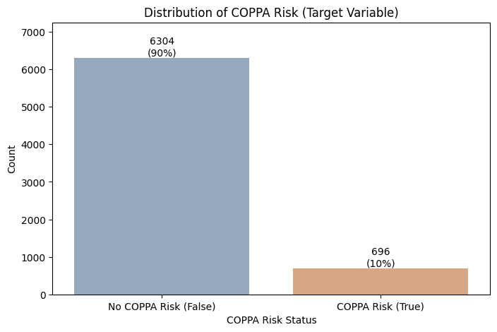
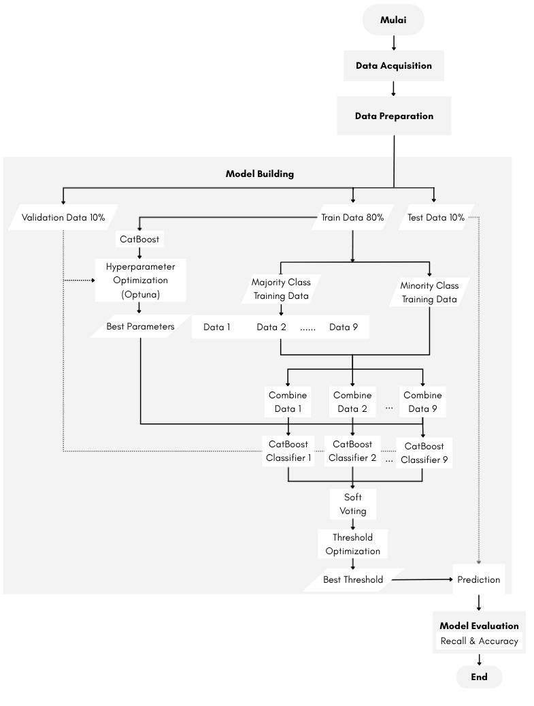

# Child-Privacy-Risk-Detection-for-Applications

An end-to-end machine learning project for identifying digital applications that potentially violate children's privacy regulations (COPPA) using CatBoost with hyperparameter optimization and threshold optimization.

---

## Project Overview

Children increasingly interact with digital applications that may collect or misuse personal information. This project aims to classify digital applications according to their potential risk of violating children's privacy regulations (COPPA).

The proposed solution uses CatBoost, a gradient boosting algorithm that naturally handles categorical features, combined with Optuna for hyperparameter optimization and threshold optimization to improve the detection of high-risk applications in an imbalanced dataset.

---
## Dataset

The dataset used in this project was obtained from the **Find IT 2025 Data Analytics Competition** hosted on Kaggle. It contains approximately **7,000 application records** with **17 features**, including the target variable.

According to the competition description, the dataset was collected through web scraping from a major application distribution platform and enriched with privacy-related attributes based on the **Children's Online Privacy Protection Act (COPPA)**. The objective is to identify digital applications that potentially violate children's privacy regulations.

### Target Variable

- **coppaRisk**
  - `True` → High risk of violating COPPA.
  - `False` → Low risk of violating COPPA.
 
### Sample Records

The table below shows the first five records from the raw dataset.

| developerCountry | countryCode | userRatingCount | primaryGenreName | downloads | deviceType | hasPrivacyLink | hasTermsOfServiceLink | hasTermsOfServiceLinkRating | isCorporateEmailScore | adSpent | appAge | averageUserRating | appContentBrandSafetyRating | appDescriptionBrandSafetyRating | mfaRating | coppaRisk |
|------------------|-------------|----------------:|------------------|-----------|------------|----------------|-----------------------|-----------------------------|----------------------:|---------:|--------:|------------------:|------------------------------|---------------------------------|-----------|-----------|
| NORWAY | RO | 127731 | Sports | NaN | smartphone | True | True | low | 99.0 | 14.017220 | 160.400000 | 4.0 | medium | low | low | False |
| ADDRESS NOT LISTED IN PLAYSTORE | GLOBAL | 0 | Medical | 50 - 100 | GLOBAL | True | NaN | NaN | 99.0 | NaN | 17.500000 | 0.0 | NaN | low | low | False |
| UNITED ARAB EMIRATES | CZ | 51143 | Games | 50000000 - 100000000 | GLOBAL | True | True | low | 0.0 | 31.883163 | 30.766667 | 4.0 | NaN | low | low | False |
| GERMANY | GLOBAL | 1074 | Games | NaN | GLOBAL | True | NaN | NaN | 99.0 | NaN | 71.533333 | 4.0 | NaN | low | low | False |
| CANNOT IDENTIFY COUNTRY | GLOBAL | 17 | Tools | 1000 - 5000 | GLOBAL | True | NaN | NaN | 99.0 | NaN | 52.400000 | 4.0 | NaN | low | low | False |


### Raw Dataset Overview
The dataset consists primarily of **11 categorical features**, complemented by **five numerical features** including `userRatingCount`, `isCorporateEmailScore`, `adSpent`, `appAge`, and `averageUserRating`.
| Feature | Type | Description | Missing (%) |
|----------|------|-------------|------------:|
| developerCountry | String | Country where the application developer is located. | 0.00 |
| countryCode | String | Application marketplace country code. | 0.91 |
| userRatingCount | Integer | Total number of user ratings. | 0.00 |
| primaryGenreName | String | Primary application category. | 0.00 |
| downloads | String | Download count range. | 30.70 |
| deviceType | String | Compatible device type. | 0.00 |
| hasPrivacyLink | Boolean | Indicates whether a privacy policy link is available. | 10.71 |
| hasTermsOfServiceLink | Boolean | Indicates whether a terms of service link is available. | 66.21 |
| hasTermsOfServiceLinkRating | String | Quality rating of the terms of service link. | 66.21 |
| isCorporateEmailScore | Float | Likelihood that the developer uses a corporate email domain. | 16.11 |
| adSpent | Float | Estimated advertising expenditure. | 81.13 |
| appAge | Float | Application age (days since release). | 0.71 |
| averageUserRating | Float | Average user rating. | 17.60 |
| appContentBrandSafetyRating | String | Content safety rating of the application. | 88.03 |
| appDescriptionBrandSafetyRating | String | Safety rating of the application description. | 0.00 |
| mfaRating | String | Advertising/monetization orientation rating. | 0.00 |
| coppaRisk | Boolean | Target variable indicating potential COPPA violation risk. | 0.00 |

### Class Distribution

The target variable is highly imbalanced, with an approximate **1:9 ratio** between high-risk (`True`) and low-risk (`False`) applications.
<p align="center">

</p>


## Workflow

<p align="center">

</p>

The workflow consists of:

1. Data Cleaning
2. Exploratory Data Analysis
3. Feature Engineering
4. Train–Validation–Test Split
5. CatBoost Training
6. Hyperparameter Optimization (Optuna)
7. Threshold Optimization
8. Model Evaluation

---

## Data Preprocessing

The preprocessing pipeline includes:

- Removing duplicate records
- Correcting invalid values
- Handling missing values
- Standardizing categorical variables
- Feature engineering
- Train–Validation–Test split (80:10:10)

---

## Machine Learning Model

The proposed model uses:

- CatBoost Classifier
- Optuna Hyperparameter Optimization
- Threshold Optimization
- Soft Voting Ensemble (Mutually Disjoint Dataset Strategy)

---

## Model Performance

| Metric | Score |
|---------|------:|
| Accuracy | 79% |
| Macro Recall | 0.84 |
| Minority Recall | 0.90 |
| Majority Recall | 0.78 |

The optimized CatBoost model successfully detected **90% of high-risk applications**, significantly improving minority-class detection compared to the baseline model.

---

## Confusion Matrix

<p align="center">

</p>

---

## Feature Importance

<p align="center">

</p>

The model identifies privacy-related features as the most influential factors in determining whether an application poses a potential privacy risk to children.

---

## Key Insights

- The dataset is highly imbalanced, with approximately a 1:9 ratio between high-risk and low-risk applications.
- Hyperparameter optimization substantially improves model performance.
- Threshold optimization increases recall for the minority class without relying on oversampling techniques.
- CatBoost effectively handles heterogeneous tabular data containing both categorical and numerical features.
- Privacy-related attributes contribute the most to prediction performance.

---

## Recommendations

- Use the model as an initial screening tool for newly published applications.
- Prioritize manual review for applications predicted as high risk.
- Continuously retrain the model using updated application metadata.
- Integrate explainability methods (e.g., SHAP) to improve model transparency.

---

## Repository Structure

```
Child-Privacy-Risk-Detection/
│
├── notebooks/
│   └── Child_Privacy_Risk_Detection.ipynb
│
├── images/
│   ├── workflow.png
│   ├── class_distribution.png
│   ├── confusion_matrix.png
│   └── feature_importance.png
│
├── README.md
├── requirements.txt
└── LICENSE
```

---

## Installation

Install the required dependencies:

```bash
pip install -r requirements.txt
```

---

## Technologies

- Python
- Pandas
- NumPy
- Scikit-learn
- CatBoost
- Optuna
- Matplotlib
- Seaborn

---

## References

- Kaggle Find IT 2025 Competition
- CatBoost Documentation
- Optuna Documentation
- Children's Online Privacy Protection Act (COPPA)

---

## Author

**Devina Sawitri**

Data Science Graduate — Universitas Negeri Surabaya
